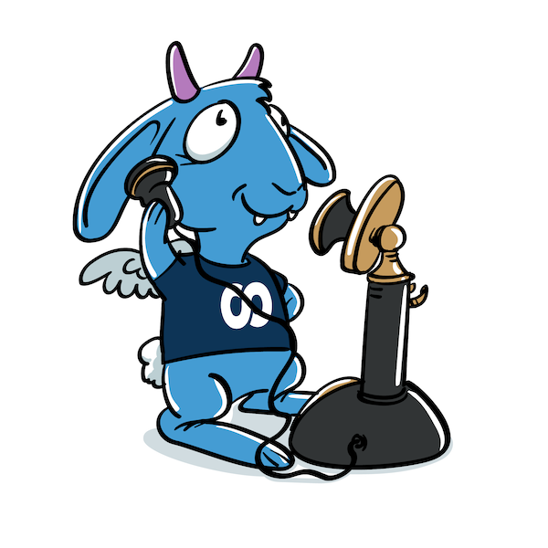

[](https://github.com/foomo/gotsrpc/actions/workflows/test.yml)
[](https://goreportcard.com/report/github.com/foomo/gotsrpc)
[](https://godoc.org/github.com/foomo/gotsrpc)

<p align="center">
  
</p>

# Go / TypeScript and Go / Go RPC

## Documentation

Please refer to the [documentation](https://www.foomo.org/docs/projects/gotsrpc).

```shell
$ gotsrpc
gotsrpc

Usage:
  gotsrpc [options] <config-file>

Options:
  -version   Display version information
  -debug     Print debug information

Examples:
  $ gotsrpc path/to/gotsrpc.yaml
```

## Installation

Please follow the [documentation](https://www.foomo.org/docs/projects/gotsrpc/cli#installation).

### Download binary

Download a [binary release](https://github.com/foomo/gotsrpc/releases)

### Build from source

```
go install github.com/foomo/gotsrpc@latest
```

### Homebrew (Linux/macOS)

If you use [Homebrew](https://brew.sh), you can install like this:
```
brew install foomo/tap/gotsrpc
```

### Mise

If you use [mise](https://https://mise.jdx.dev), you can install like this:
```
mise use github.com:foomo/gotsrpc
```

Release downloads:

[https://github.com/foomo/gotsrpc/releases](https://github.com/foomo/gotsrpc/releases)

## How to Contribute

Contributions are welcome! Please read the [contributing guide](CONTRIBUTING.md).


## License

Distributed under MIT License, please see license file within the code for more details.

_Made with ♥ [foomo](https://www.foomo.org) by [bestbytes](https://www.bestbytes.com)_
